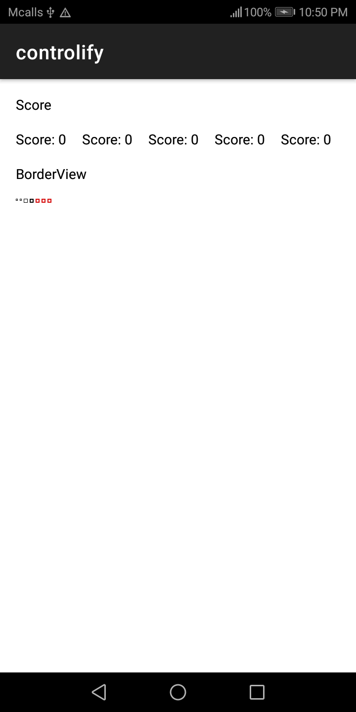

# controlify
It is a GUI library based on Android that can help developers create mobile client applications, video games and etc in record time.

  

## Table of Contents
- [For developers reading this in GitHub](https://gitlab.com/ii887522/controlify#for-developers-reading-this-in-github)
- [Prerequisites](https://gitlab.com/ii887522/controlify#prerequisites)

## For developers reading this in GitHub
Please go to https://gitlab.com/ii887522/controlify to start contributing instead.

## Prerequisites
- [Visual Studio Code](https://code.visualstudio.com/)
  - EditorConfig for VS Code
  - Markdown All in One
  - YAML
- [Android Studio 4.1.2](https://developer.android.com/studio) and later
